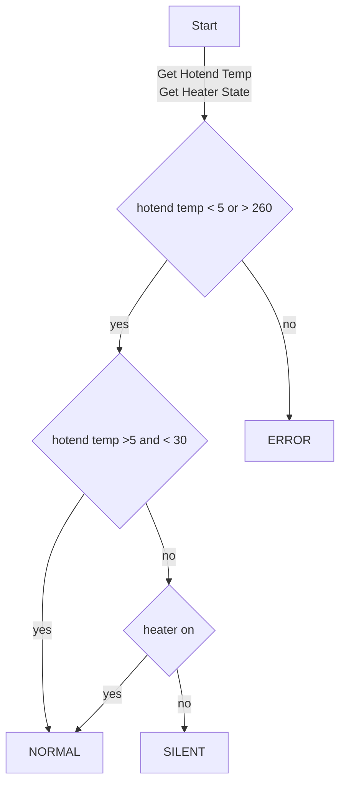

# Firmware

The firmware is built using esphome. Binaries are automatically built and uploaded to the [releases page](https://github.com/Ankermgmt/ankermake-m5-muffler/releases).


## Building the firmware

To build the firmware, you need to have esphome installed. You can install it using pip:

    pip install esphome

You can then use the included Makefile to build the firmware:


```bash
    cd firmware
    make clean
    make build
```

To upload the firmware, first identify the com port (windows) or devices (mac/linux) that the device is plugged into. The name will look like `/dev/cu.wchusbserialXXXX`

**Note: if this doesn't work, see the troubleshooting section below**

Run the `make run` command to upload the firmware and start the device:

```bash
export USB_ADDRESS=/dev/cu.wchusbserialXXXX
# Make sure to uncomment the wifi settings in common.yaml
make run-usb
# Delete or comment out the wifi settings in common.yaml
```

Once the device is joined to the wifi, you can do subsuiqnet uploads using the `run-ota` make command. No usb cable required

```bash
make run-ota
```

Once done uploading, you may need to press the reset button on the device to start the firmware.

You can then view logs through the command line or the web interface

```bash
export USB_ADDRESS=/dev/cu.wchusbserialXXXX
make logs
```

or

```bash
export USB_ADDRESS=/dev/cu.wchusbserialXXXX
make dashboard
```

See the [Makefile](Makefile) for all available commands.

- clean
- build
- upload
- run
- logs
- dashboard
- run-usb
- run-ota


## Logic



## Troublshooting

- Unable to upload firmware with `make upload`
```
ERROR Running command failed: Failed to connect to ESP32-S2: No serial data received.
```

Solutions: 
- Try running make upload twice. If the serial port is busy it may timeout
- Try removing/enabling `DARDUINO_USB_CDC_ON_BOOT` in esphome config
- Put the device into bootloader mode
    - press and hold D0 button
    - press and release reset button
    - release D0 button
- Try a different baud rate (460800 or 115200)